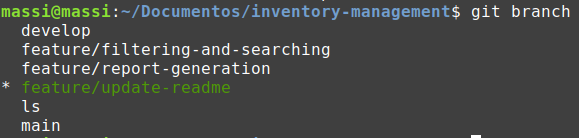
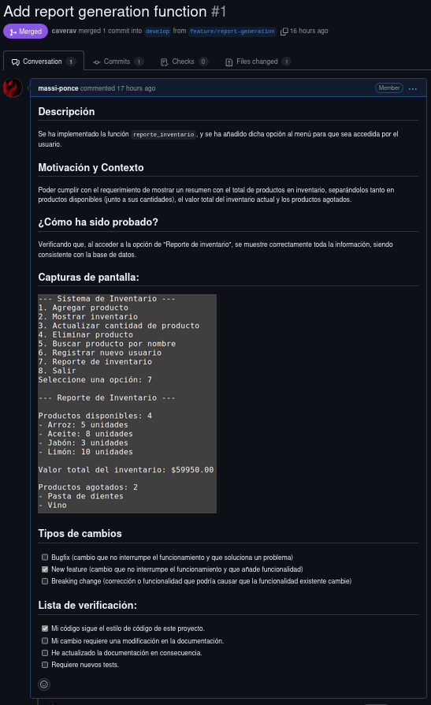

# Entregable

## ¿Cómo especificarías mejor el requerimiento?

Para validar mejor los requerimientos y asegurarnos de que estamos resolviendo el problema correcto para el cliente, realizaríamos las siguientes acciones:

1. Entrevista con el emprendedor: de esta forma le podríamos preguntar directamente sobre cosas del modelo de negocio para entender de mejor forma el problema que queremos resolver. Por ejemplo: saber qué tipos de productos maneja, con qué frecuencia hace actualización de inventario, si necesitará exportar los reportes en algún formato, etc.

2. Especificación más detallada de las funcionalidades: al reescribir los requerimientos con más detalle podemos saber si comprendimos bien el problema y si lo que vamos a desarrollar cumple con el propósito solicitado. Por ejemplo: indicar si las categorías de productos deben elegirse desde un listado predefinido, si el sistema debe soportar múltiples usuarios, etc.

3. Definir criterios de aceptación: nos ayudará a cumplir con todos los requerimientos para solucionar el problema correctamente. Por ejemplo: un producto debe tener todos los campos obligatorios para ser registrado, un usuario no autenticado no puede acceder al sistema, si un producto tiene cantidad = 0, debe aparecer en el listado de productos agotados, etc.

## ¿Cómo asegurarías que el programa cumpla el requerimiento?

Para validar que nuestra solución cumple correctamente con los requerimientos definidos, realizaríamos diferentes niveles de pruebas:

1. Pruebas unitarias: escribir funciones de prueba para cada operación CRUD. Por ejemplo: probar que `agregar_producto()` guarda correctamente los datos.

2. Pruebas de integración: para poder verificar que los diferentes "módulos" de la aplicación funcionan juntos. Por ejemplo: al modificar la cantidad de un producto, se debe actualizar correctamente y eso debe reflejarse en el reporte de inventario.

3. Pruebas manuales: simular el uso del sistema como lo haría el usuario. Por ejemplo: iniciar sesión (con credenciales correctas e incorrectas), etc.

4. Revisiones de código: esto nos permite detectar errores o inconsistencias en el código del compañero.

## Organización del proyecto y flujo de trabajo

Nuestra organización consistió en dividirnos, de forma arbitraria, los requerimentos a desarrollar. Cada uno tomó responsabilidad de distintos "módulos" del sistema, como por ejemplo: la autenticación, el CRUD de productos, la generación del reporte de inventario, los filtros de búsqueda, etc.

A nivel de desarrollo, seguimos una metodología basada en Git Flow. De esta forma pudimos organizarnos de forma ordenada, paralela, mantener un código limpio y evitar conflictos.

El flujo de trabajo que aplicamos consistía en lo siguiente:

1. Rama principal (`main`): contiene la versión estable del sistema.

2. Rama de desarrollo (`develop`): donde se implementan todas las funcionalidades del sistema antes de pasar a `main`.

3. Ramas de funcionalidad (`feature/<nombre>`): para cada nuevo requerimiento, se creó una rama específica.

4. Pull Requests: cada vez que se completaba una funcionalidad, se abría un PR desde la rama `feature` hacia `develop`. Esto permitía revisar el código antes de hacer el merge.

5. Ramas de release (`release/<versión>`): cuando ya teníamos una versión completa y probada en `develop`, creábamos una rama de release para hacer ajustes finales y luego se hacía el merge hacia `main`.

Además, usamos mensajes de commits descriptivos (usamos `gitmoji`) y una plantilla en la creación de PRs para mejorar la calidad de ellas y facilitar su lectura.

### Evidencias

## Problemas encontrados y soluciones

Afortunadamente no se presentaron problemas durante el desarrollo de la tarea. Creemos que la forma en la que organizamos el proyecto, el flujo de trabajo que adoptamos y la aplicación de los contenidos del ramo nos ayudó a que el trabajo se desarrollara de forma fluida y con un buen estándar de calidad.
